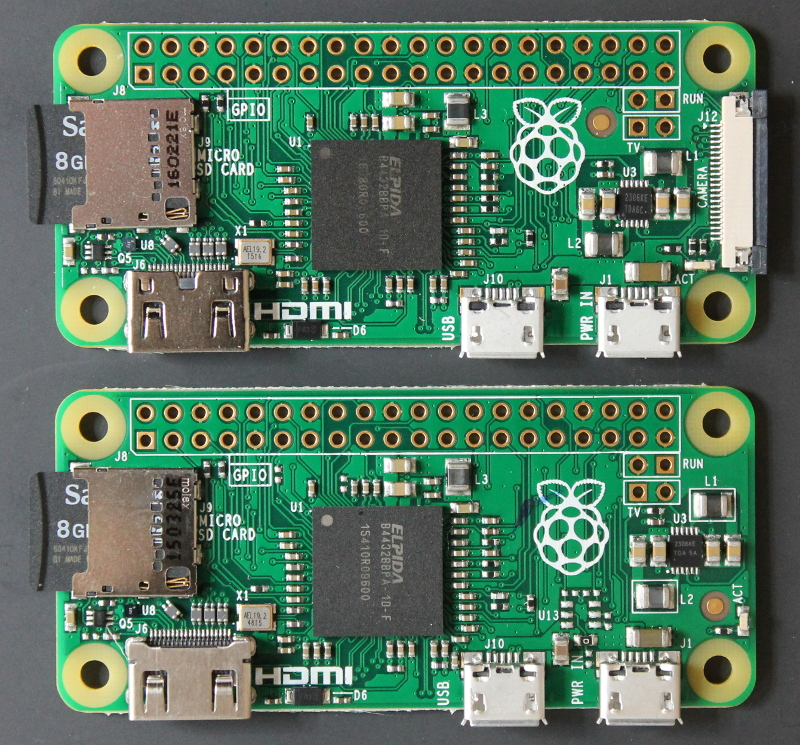

# Name the book and win a Pi!

**I need a snappy title for this book.**

It's an introduction to the Dyalog implementation of the
[APL programming language](http://www.dyalog.com/), aimed primarily at people learning it on the Raspberry Pi.

APL runs on all models of the Pi, including the £4/$5 Pi zero shown below.

You can download a copy of Dyalog APL for the Pi [here](http://packages.dyalog.com/)

If you submit a title and I use it, I will send you a Raspberry Pi model 3 complete with a power supply and an SD card.
No royalties, though, and you will need to find a monitor, keyboard and mouse.

You can submit it as an issue on GitHub or email it to romilly dot cocking at gmail doc com.

The book is far from finished but it should be available in early access format on Leanpub in a few days time.

## The Raspberry Pi zero

