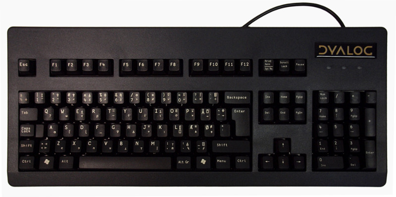

# Chapter 1

## Getting started

One reason to love APL is that you can try things out as you find out about them, and that's a great way to learn.

To start your first APL session, run __Dyalog__ from the __Programming__ menu. (If you're using RIDE, folow the
instructions in Appendix 2.)

To follow these examples you'll need to start an APL session or log on to the [tryapl.org](http://tryapl.org/) website.

Once you've done that, you can type the code you'll see below.

In the examples that follow, code that you type is indented by six spaces. Once you start trying APL,
you'll see that APL inserts those spaces for you when it's ready for you to type.

So - here goes. Type

~~~~~~~~
      2 + 2
4
~~~~~~~~

TODO: add link to wikipedia
So far, so good. As you can see, the APL environment includes a
[REPL](https://en.wikipedia.org/wiki/Read%E2%80%93eval%E2%80%93print_loop) - a Read-Evaluate-Print-Loop.

That means that you can write code and try it out right away. As mentioned above, that's a great way to learn a lanugage,
and it's also a great way to develop software.

Try some more:

~~~~~~~~
       10 - 4
6
       4 - 5
¯1
~~~~~~~~

Note how APL represents negative numbers using a `¯` symbol. The `¯` (called __high minus__) is part of the way you
write the value __negative one__. That's different from the - symbol (called __minus__) which tells APL to do a
subtraction.

Plus and minus are __primitive functions__ in APL. What about multiply and divide? Of course APL does those too.

APL uses the same symbols that I was taught at school: `×` for multiply, and `÷` for divide.

If you're using the tryapl.org website, you can type these symbols by clicking on the APL Keyboard button at the top
right of your browser window. If you're running APL on a Raspberry Pi, you can hold down the Windows key to type APL
symbols.

* Type Windows- and you should see a `×` symbol
* Type Windows-equals to get the `÷` sign.

You can find more about how to type APL symbols at the end of this chapter.

Time to try out multiplication and division.

~~~~~~~~
      2 × 3
12
      5÷2
2.5
      12÷4  
3
      4÷3
1.333333333
~~~~~~~~

Now for something rather different. Try the experiment below,

~~~~~~~~
      1 2 3 + 4 5 6
5 7 9
~~~~~~~~

What's going on?

APL treat the two lists of numbers as __vectors__ and it adds the corresponding elements together.

A lot of calculations need to be done on vectors, and APL's built-in looping makes this really easy.

Try some more examples:

~~~~~~~~
      2 3 4 5 × 1 2 1 2
2 6 4 10
      3 4 2 5 - 4 0 ¯1 3
¯1 4 3 2
      120 ÷ 2 3	4 5 6
60 40 30 24 20
      0.1 0.1 0.1 0.1 ×	3 5 4 2
0.3 0.5	0.4 0.2
~~~~~~~~

That last example works, but it's a bit tedious to type. Fortunately there is an easy shortcut.

~~~~~~~~
      0.1 + 3 5	4 2
3.1 5.1	4.1 2.1
~~~~~~~~

If you ask APL to multiply (or add, or subtract, or divide) a number on its own and a vctor of numbers, APL will use the
single number repeatedly. A single number on its own is called a __scalar__. The repeated use of ascalazr when you're
adding it to a vector is called __scalar extension__.
 
What happens if you try to add two vectors of different lengths?

~~~~~~~~
      1 2 3 + 4 5 6 7
LENGTH ERROR
      1 2 3+4 5 6 7
     ∧
~~~~~~~~

APL doesn't kow what you want to do, so it treats the expression as an error.

Don't worry about causing APL errors. APL will try to tell you what went wrong, and you won't break anything :)

## Assigning values to variables

It would be rather tedious if you had to type values in to APL every time you wanted to use them. Fortunatly, you can
tell APl to remember values you want to use repeatedly. Suppose you are currently 23. Type:

~~~~~~~~
      age ← 23
      age + 10
33
~~~~~~~~

The first line you typed told APL to assign the value 23 to a new variable __age__.

In the second line you asked APL to add 10 to your current age, and APL displayed the result.

Notice that APL will display a result if you don't tell it what to do with it.

## System commands

If you've been working on an APL sesion for a while it can be useful to check what variables you have created.

APl has a __system command__ to do that. System commands in APL don't create values, but they do useful things.
One such command will tell you the names of all the variables you have defined. Try it out:

~~~~~~~~
      )vars
age
~~~~~~~~

In APL, system commands start with an open right bracket. The __vars__ command tells you the name of the variables that
are currently defined.

When you work in an AL session, the variables you create are held in what APL calls the __current workspace__.

A workspace can also contain functions and other things. We'll cover these later in this course.

When you have finished an APL session, you can save the contents of your workspace, and return to it when next
you use APL. Try the following commands:

~~~~~~~~
      )wsid course
was CLEAR WS
      )save
course saved Sun May 22 17:09:17 2016
~~~~~~~~

What did that do?

The first dommand gave a name to your workspace. (Previously it had no name, so APL showed that it was a clear
workspace.

Then you asked APL to save your worksace. It stored it on disk; if you look in your home directory, you should see a file
called __course__. It's a binary file, so don't try to edit it!

Names are useful. If you are working on more than one project, you can have several workspaces, one for each prject.
Each ahs a name which will help you find the workspace you want to use for any given session.

## Finishing your session

## The Dyalog APL keyboard

If you get really hooked on APL you will want to invest in a Dyalog keyboard. Until then, you can use the photo below to
remind you of the locations of APL's special characters.

