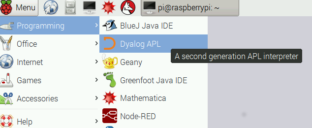
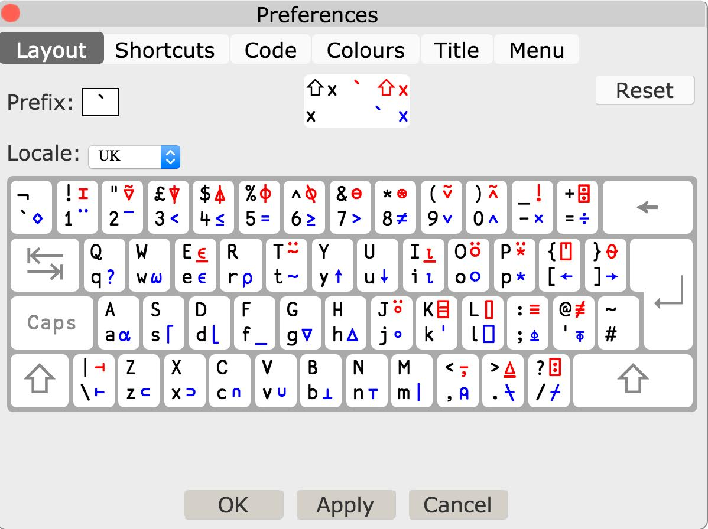

# Chapter 1

## Getting started

Time to start APL - and start learning!

To begin your first APL session on a Raspberry Pi, run _Dyalog_ from the _Programming_ menu.

(If you're using RIDE to connect to a Raspberry Pi or some other computer with APL installed, follow the
instructions in Appendix 2 - once I've written them!)

The APL environment includes a
[REPL](https://en.wikipedia.org/wiki/Read%E2%80%93eval%E2%80%93print_loop) - a Read-Evaluate-Print-Loop.

That means that you can write code and try it out right away. That's a great way to learn a lanugage,
and it's also a great way to develop software.

In the examples that follow, code that _you_ type is indented by six spaces. Once you start your session
you'll see that APL inserts those spaces for you when it's your turn to type.

APL's output is **not** indented, so you can see what you should type and what you should expect APL to output.

So - here goes. Type

~~~~~~~~
      2 + 2
4
~~~~~~~~

Try some more:

~~~~~~~~
       10 - 4
6
       4 - 5
¯1
~~~~~~~~

Note how APL represents negative numbers using a `¯` symbol. The `¯` (called _high minus_) is part of the way you
write the value _negative one_. That's different from the - symbol (called _minus_) which tells APL to do a
subtraction.

Plus and minus are _primitive functions_ in APL. What about multiply and divide? Of course APL does those too.

APL uses the same symbols that I was taught at school: `×` for multiply, and `÷` for divide.

If you're running on a Raspberry Pi or a Windows computer you can hold down the Windows key to type APL symbols.

If you're using RIDE on some other computer you will need to configure your keyboard for APL. You'll find instructions
in Appendix 3.

* Type Windows- and you should see a `×` symbol
* Type Windows-equals to get the `÷` sign.

You can find more about how to type APL symbols at the end of this chapter.

Time to try out multiplication and division.

~~~~~~~~
      2 × 3
12
      5÷2
2.5
      12÷4  
3
      4÷3
1.333333333
~~~~~~~~

Now for something rather different. Try the experiment below,

~~~~~~~~
      1 2 3 + 4 5 6
5 7 9
~~~~~~~~

What's going on?

## Array programming without explicit loops

APL treat the two lists of numbers as _vectors_ and it adds the corresponding elements together.

A lot of calculations need to be done on vectors, and APL's built-in looping makes this really easy.

Try some more examples:

~~~~~~~~
      2 3 4 5 × 1 2 1 2
2 6 4 10
      3 4 2 5 - 4 0 ¯1 3
¯1 4 3 2
      120 ÷ 2 3 4 5 6
60 40 30 24 20
      0.1 0.1 0.1 0.1 × 3 5 4 2
0.3 0.5 0.4 0.2
~~~~~~~~

That last example works, but it's a bit tedious to type. Fortunately there is an easy shortcut.

~~~~~~~~
      0.1 + 3 5	4 2
3.1 5.1	4.1 2.1
~~~~~~~~

If you ask APL to multiply (or add, or subtract, or divide) a number on its own and a vector of numbers, APL will use the
single number repeatedly. A single number on its own is called a _scalar_. The repeated use of a scalar when you're
adding it to a vector is called _scalar extension_.
 
What happens if you try to add two vectors of different lengths?

~~~~~~~~
      1 2 3 + 4 5 6 7
LENGTH ERROR
      1 2 3+4 5 6 7
     ∧
~~~~~~~~

APL doesn't kow what you want to do, so it treats the expression as an error.

Don't worry about causing APL errors. APL will try to tell you what went wrong, and you won't break anything :)

## Assigning values to variables

It would be rather tedious if you had to type values in to APL every time you wanted to use them. Fortunately, you can
tell APl to remember values you want to use repeatedly. Suppose you are currently 23. Type:

~~~~~~~~
      age ← 23
      age + 10
33
~~~~~~~~

The first line you typed told APL to assign the value 23 to a new variable _age_.

In the second line you asked APL to add 10 to your current age, and APL displayed the result.

Notice that APL will display a result if you don't tell it what to do with it.

APL variables can contain vectors as well as scalars.

~~~~~~~~
      ages ← 12 23 19
      ages
12 23 19
      ages×2
24 46 38

~~~~~~~~

## A shortcut to counting

In one of the earlier examples you added the vector 1 2 3 to the vector 4 5 6.

Mathematicians call vectors like that _arithmetic progressions_, and you way well need to use them in your software.

APL has a particularly easy way to create them, using the `⍳` function.

Here are a some examples of its use:

~~~~~~~~
      ⍳3
1 2 3
      3 + ⍳3
4 5 6
      (⍳3) + 3 + ⍳3
5 7 9
      2 × ⍳5
2 4 6 8 10
~~~~~~~~

I> By default APL starts counting at one. In Chapter 6 you will see a way to get APL to start counting at zere. Some
programs are simpler when written that way.

## Illuminate your code - use comments

As you get more experienced in APL programming the code you write will get more complex.

Most code is read more often than it is written, so you should consider documenting it using _comments_.

The APL symbol for a comment is `⍝` - often called _lamp_ because it's intended to illuminate your code.

Whenever the APl interpreter encounters a comment it ignores the rest of that line. You'll find two styles of comment
widely used in APL code.

1. A stand-alone comment starts with a lamp symbol. That means tha nothing on that line will get executed.
1. An in-line comment follows some executable code on the same line. It explains what the code does or why it is
written that way.

### What should you comment? The Three AM rule

I first heard this tip at a conference many yeas agp. It's called 'The three AM rule', and it applies to programming in
any language. Here's how I once heard the presenter explain the rule:

> Imagine that you're asleep at home at 3 o'clock in the morning.

> The phone rings. And rings. And rings.

> You answer it.

> 'Hi there. The production system has just fallen over. Can you fix it?'

> When you take a look at the application, what style of code do you hope you'll see? That's the way _you_ should code.

That's the three AM rule. Write code that you, or other developers, would be relieved to see if they are trying to fix a
problem at three o'clock in the morning.

If comments would help you or others to read your code at 3 AM, add those comment!

## Catenate

So far you've seen ways of combining vectors based on arithmetic functions.

There's another common way to create new arrays from old: by joining them together.

In APL, a `,` (comma) is the _catenate_ function.

Try it out:

~~~~~~~~
      1 2 3, 6 5 4
1 2 3 6 5 4
      1, 4 7 11
1 4 7 11
      5 3 7, 0
5 3 7 0
      2 3, 5 6 8
2 3 5 6 8
~~~~~~~~

Ypu can catenate any two vectors, or a vector and a scalar, or a scalar with a vector. Later in the book you will see
that there are even more possibilities.

## System commands

If you've been working on an APL session for a while it can be useful to check what variables you have created.

APl has a _system command_ to do that. System commands in APL don't create values, but they do other useful things.
One such command will tell you the names of all the variables you have defined. Try it out:

~~~~~~~~
      )vars
age ages
~~~~~~~~

In APL, system commands start with an open right bracket. The _vars_ command tells you the name of the variables that
are currently defined.

When you work in an APL session, the variables you create are held in what APL calls the _current workspace_.

A workspace can also contain functions and other things. We'll cover these later in this book.

When you have finished an APL session, you can save the contents of your workspace, and return to it when next
you use APL. Try the following commands:

~~~~~~~~
      )wsid course
was CLEAR WS
      )save
course saved Sun May 22 17:09:17 2016
~~~~~~~~

What did that do?

The first command gave a name to your workspace. (Previously it had no name, so APL showed that it was a clear
workspace.

Then you asked APL to save your workspace. It stored it on disk. If you look in your home directory, you should see a
file called _course_.

It's a binary file, so don't try to edit it!

Names are useful. If you are working on more than one project, you can have several workspaces, one for each project.
Each has a name which will help you find the workspace you want to use for any given session.
 
You can find out all the local workspaces using the )LIB command. Here's what happened when I ran it:

~~~~~~~~
      )lib
.
        startapl.dws    
/opt/mdyalog/15.0/32/unicode/ws
        apl2in.dws      apl2pcin.dws    buildse.dws     conga.dws       ddb.dws 
        dfns.dws        display.dws     eval.dws        fonts.dws       ftp.dws 
        groups.dws      isolate.dws     loaddata.dws    max.dws min.dws ops.dws 
        postscri.dws    quadna.dws      rconnect.dws    salt.dws        
        sharpplot.dws   smdemo.dws      smdesign.dws    smtutor.dws     
        sqapl.dws       tube.dws        tutor.dws       util.dws        
        xfrcode.dws     xlate.dws       
/opt/mdyalog/15.0/32/unicode/samples/fun
        intro.dws       life.dws        sudoku.dws     
~~~~~~~~

Wow! Lots of workspaces.

The first two lines show that there is a workspace called startapl.dws in the current directory.
That's a workspace that I saved earlier. It contains the functions and varibales used in this course.

The next line shows that there is a directory called `/opt/mdyalog/15.0/32/unicode/ws` which contains 31 workspaces.
That directory and the workspaces in it are created by Dyalog during the installation process.

There's also a Dyalog directory called `/opt/mdyalog/15.0/32/unicode/samples/fun` which contains some fun workspaces including
APL implementations of [Conway's Game of Life](https://en.wikipedia.org/wiki/Conway%27s_Game_of_Life) and the game of
sudoku.

## Finishing your session

Once you've finished a session you can close APL down by typing a system command:

~~~~~~~~
      )off
~~~~~~~~

APL will close down.

If you want to get your work back, restart APL from the Programming menu. You will start a new session with a new
clear workspace. To resume your work you must load your saved workspace. Type

~~~~~~~~
      )load course
./course saved Sun May 22 17:09:17 2016
~~~~~~~~

Now you can check that the workspace still contains your variable:

~~~~~~~~
      )vars
age ages
      age
23
~~~~~~~~

Well done! You've taken the first step to mastering APL. Now try the following simple exercises to consolidate what
you've learned.

## Exercises

### 1.1

Create a variable called _income_ containing the vector 10000 11570 11000 12550. (This might contain someone's income
for the last four quarters of the year.)

Create another variable containing the vector 7250 8345 9547 12650. This might show how much that person spent
in each quarter.

Now calculate and display what they saved each quarter. Of course, if they spent more than they earned the savings will
be negative.

### 1.2

Create a variable _weights_ containing the numbers 10.2 8,3 7.5 and convert from pounds to kilogrammes.
A pound is roughly 0.45 kilogrammes,

## The Dyalog APL keyboard

Here's the layout of the UK APL keyboard.

TODO: Explain about key shifts and move earlier in text.

