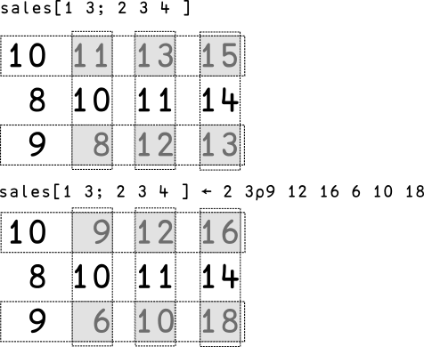

# Chapter 2

## More useful techniques

In the last chapter you created a variable called ages containing the vector 12 23 19.

How can you find the average age?

The average is defined as the total divided by the number of ages.

You could work out the total like this:

~~~~~~~~
      12+23+19
54
~~~~~~~~

Now you can divide that by 3 (the number of ages)

~~~~~~~~
            54÷3
18
~~~~~~~~

What if you had a dozen ages? That approach would get rather tedious. Luckily there is an easier way.

## Plus Reduction

First, here is a shortcut for calculating totals.

~~~~~~~~
      +/ages
54
~~~~~~~~

+/ages (pronounced the _plus reduction_ of ages) tells APL to insert the + function between each item in `ages`.
That calculates the total.

Now you need an easy way to find out hom many items there are in `ages`. It's obvious if there are just three items,
but it would be tedious to count if there were 10, or fifty, or a thousand.

Here's the quick way to find out.

~~~~~~~~
      ⍴ ages
3
~~~~~~~~

Used this way, the greek letter `⍴` (or rho) tells you the shape of the `ages` array.

You can combine the two fragments of code.

~~~~~~~~
      +/ages÷⍴ ages
18
~~~~~~~~

That works, but perhaps not for the reason you were expecting!

APl will evaluate the expression like this: _calculate the sum of (each age divided by the number of ages)_.
In other words, APL will do three divisions, one for each age, and sum the result.

That works out as the same value that you want to calculate, which is _divide the total age by the number of ages_.
That's a better approach, as it does one division instead of three.

You can tell APL to do that by using parentheses (round brackets). Here's the code:

~~~~~~~~
      (+/ages)÷⍴ ages
18
~~~~~~~~

## User-defined functions

You might need to calculate a lot of averages in some applications. It would be tedious to have to type the same code
over and over again, so APL lets you create _user-defined functions_.

The simplest way to do this is to use _direct definition_. To create a function that way, you type an expression
and give it a name.

The average will be a function which takes a single argument on its right which will be the array to be averaged.

By convention, you refer to that argument as ⍵.

Here's what you type to define your average function:

~~~~~~~~
      average ← {(+/⍵)÷⍴⍵}
~~~~~~~~

You can use it like this:

~~~~~~~~
      average ages
18
~~~~~~~~

The function will work for any number of items.

~~~~~~~~
      average 1 2 3 4 5 6 7 8 9
5
~~~~~~~~

## APL Operators - reduction revisited

This example used reduction. In APL, reduction is defined to be an _operator_.
An operator takes one or more operands and creates a new function.

A _function_ (like `+`, `-`, and `⍴`, among many others) takes one or two array arguments and returns an array result.

In _plus reduction_, the operator / takes + (the add function) and turns it into a new function, _sum_.

What do you think _times reduction_ would do? (You'd write that as ×/)

Try it out.

~~~~~~~~
      ×/ 2 3 
6
      ×/ 2 3 5
30
      ×/10 10 10
1000
~~~~~~~~

Times reduction calculates the product of a vector.

Suppose you have a box of size 2 cm by 3 cm by 6 cm. What is its volume?

~~~~~~~~
      size ← 2 3 6
      volume ← ×/size
      volume
36
~~~~~~~~

Reduction turns out to be very useful. To see another use, you need to learn about two more
of APL's mathematical functions: `⌈` (_max_) and `⌊` (_min_).

Max return the larger of its left and right arguments; min returns the smaller of its arguments. Try them out:

~~~~~~~~
      2 ⌈ 3
3
      2 ⌊ 3
2
~~~~~~~~

What about _max reduction_?

~~~~~~~~
      ⌈/ 1 4 6 3 9 2 
9
~~~~~~~~

Max reduction returns the largest element in a vector. Min reduction returns the smallest element.

~~~~~~~~
      ⌊/ 1 4 6 3 9 2 
1
~~~~~~~~

If you have trouble remembering which is which you could always define max and min functions like this:

~~~~~~~~
      max←{⌈/⍵} 
      min←{⌊/⍵}
      max 1 4 6 3 9 2 
9
      min 1 4 6 3 9 2 
1
      ages
12 23 19
      max ages ⍝ how old is the oldest?
23
      min ages ⍝ how old is the youngest?
12
~~~~~~~~

## Another system command

Earlier you met system commands that you could use to save your workspace, load a saved workspace, and finish your APL
session.

Here's another system command:

~~~~~~~~
      )fns 
average      max     min
      ⍝ )fns lists all the functions in the current workspace     
~~~~~~~~

## Matrices

So far you've met vectors and scalars. One of APL's great strengths is that it can handle arrays of higher dimension.

You've probably met _matrices_ (arrays with two axes) and you may have met _tensors_ (arrays with three or more axes).
APL handles them all with ease.

You can create a matrix using the _reshape_ function.

~~~~~~~~
      2 3⍴1 2 3 4 5 6
1 2 3
4 5 6
~~~~~~~~

That may look surprising, Earlier you saw `⍴` used with just one argument to its right; it returned the _shape_ of the argument.
When ⍴ is used with arguments to its left and right, it _reshapes_ the right argument according to the value specified
in the left argument.

What do you thing will be the result of executing `⍴ 2 3⍴ 1 2 3 4 5 6`?

APL reads this as 'return the shape of reshaping 1 2 3 4 5 6 into a 2-row, 3-column matrix' so the result is the
vector 2 3.

~~~~~~~~
      ⍴2 3⍴1 2 3 4 5 6
2 3
~~~~~~~~

If you ask APL to reshape an array and there are not enough elements to populate your result, APL cycles through the
array you provide as often as necessary.

~~~~~~~~
      2 3⍴1 2 3
1 2 3
1 2 3
~~~~~~~~

You can create multi-dimensional arrays just as easily.

~~~~~~~~
      bits←2 3 4⍴0 1
      bits
0 1 0 1
0 1 0 1
0 1 0 1
       
0 1 0 1
0 1 0 1
0 1 0 1
~~~~~~~~

As you can see, APL displays a 3-axis array one plane at a time with a blank row between them.

## Rank

How can you find out how many axes an APL array has? Use `⍴⍴`, called _rank_.

Rank is not a new function. It is just the repeated use of `⍴` (or shape).

Recall that the shape of an array is an array that tells you its size in each dimension, so the rank
(the shape of the shape) tells you how many dimensions there are.

~~~~~~~~
      ⍴⍴ ages ⍝ ages is a vector
1
      ⍴⍴ mat ⍝ mat is a matrix
2
      ⍴⍴ bits ⍝ bits is a tensor
3
~~~~~~~~

What do you think is the rank of a scalar: a number on its own, like the variable `age`?

~~~~~~~~
      age←42
      ⍴⍴ age ⍝ age is a scalar
0
~~~~~~~~

A scalar has _rank zero_. Don't worry if that seems a little strange at first; just try to remember it,
and don't let it surprise you when you see it again!

## Monadic and Dyadic functions

Like `⍴` , many of APL's symbols have two meanings depending on whether they are used with one argument or two.
When you use a function with one argument, you say the function is _Monadic_. When you use a function with two arguments,
you describe it as _Dyadic_.

For example, the `÷` symbol, used dyadically, means division. Used monadically, it means _reciprocal_.
(The reciprocal of a number is 1 divided by that number).

~~~~~~~~
      1 2 4 8 ÷ 2
0.5 1 2 4
           ÷2
0.5
~~~~~~~~

Other functions also have different uses when used monadically.

You've seen the dyadic use of `,` to catenate two vectors together.

Monadic `,` is called _ravel_ (pronounced with the stress on the first
syllable). Ravel turns any array into a vector
by listing the elements of the array one after another.

~~~~~~~~
      mat ← 2 3⍴⍳6
      mat
1 2 3
4 5 6
      ,mat
1 2 3 4 5 6
~~~~~~~~

Monadic `⌈` is called _ceiling_. It rounds each element of its argument
up to the nearest integer. If the argument is already an integer it is
unchanged.

~~~~~~~~
      ⌈ 1.4 1.6 2 ¯1.3 1.7 ¯0.5 3
2 2 2 ¯1 2 0 3
~~~~~~~~

Can you guess what `⌊` does, and what it's called?

Try an experiment:

~~~~~~~~
      ⌊ 1.4 1.6 2 ¯1.3 1.7 ¯0.5 3
1 1 2 ¯2 1 ¯1 3
~~~~~~~~

`⌊` is called _floor_. It rounds each element of its argument down to the nearest integer.
If the argument is already an integer it is unchanged.

# Indexing

Once you'ver created an array you often want to select items from it.

Most computer languages let you do this by _indexing_ the array, and APL
is no exception. However, indexing in APL is particularly powerful.

You can select items of an array using indices within square brackets [].

Try these examples:

~~~~~~~~
      ages
12 23 19
      ages[1]
12
      ages[2 3]
23 19
      ages[2 1 3 2 3 1]
23 12 19 23 19 12
~~~~~~~~

As you can see, APl lets you select as many items as you like, as many
times as you like.

What happens if you use a matrix of indices?

~~~~~~~~
      ages[2 3⍴2 1 3 2 3 1]
23 12 19
23 19 12
~~~~~~~~

You get a matrix result!

When you select items from a vector, the shape of the result is the same
as the shape of the array of indices.

What happens if you try to index an array using an index that's
outside the array?

~~~~~~~~
      ages[7]
INDEX ERROR
      ages[7]
     ∧
~~~~~~~~

You get an _index error_. The same thing would happen if you used a zero,
negative or non-integer index.

## Indexing items from matrices

Imagine that you have a table of quarterly sales for each of three
products.

You might create it like this:

~~~~~~~~
      sales ← 3 4 ⍴ 10 11 13 15 8 10 11 14 9 8 12 13
      sales
10 11 13 15
 8 10 11 14
 9  8 12 13
~~~~~~~~

How can you select _all_ the sales for product number 1?

~~~~~~~~
      sales[1;1 2 3 4] ⍝ select all of the first row
10 11 13 15
~~~~~~~~

To select items from a two-dimensional matrix, you must specify which
row(s) and which column(s) you want.

In the example above, you want row number 1 and all the columns.

There's a useful shorthand iy you want all the columns in a given row:

~~~~~~~~
      sales[1;]
10 11 13 15
~~~~~~~~

If you leave out the column indices, APL assumes that you want them all.

How can you select the column of the matrix containing sales
for Quarter two?

~~~~~~~~
      sales[;2]
11 10 8
~~~~~~~~

You select _rows_ (corresponding to the _first_ axis of the array) by
specifying indices _before_ the semi-colon within the index brackets.

You specify _columns_ (corresponding to the _second_ axis of the array) by
specifying indices _after_ the semi-colon within the index brackets.

How about arrays of higher rank?

Three-dimensional arrays are useful. If you're managing a business which sells
products in several countries you might have a three-dimensional array
showing international sales by product, by country and by month.

If you have three products, two countries and sales figures for four
quarters your array would have shape 3 2 4.

You can create such an array like this:

~~~~~~~~
      international_sales ← 3 2 4⍴ 7 4 6 8 7 6 6 9 8 5 5 4 7 4 6 8 6 7 6 5 7 4 6 9
      international_sales
7 4 6 8
7 6 6 9
       
8 5 5 4
7 4 6 8
       
6 7 6 5
7 4 6 9
~~~~~~~~

The array has three planes, one for each product.

Each row corresponds to a country.

Each column corresponds to a quarter.

What are the sales for the first product?

~~~~~~~~
      international_sales[1;;]
7 4 6 8
7 6 6 9
~~~~~~~~

What are the sales for the second country?

~~~~~~~~
      international_sales[;2;]
7 6 6 9
7 4 6 8
7 4 6 9
~~~~~~~~

What are the sales for the first and last quarter?

~~~~~~~~
      international_sales[;;1 4]
7 8
7 9
   
8 4
7 8
   
6 5
7 9
~~~~~~~~

As you can see, indexing in APL is very powerful.

It's not the only way of selecting data, though. We'll meet some of the 
other techniques later in this book.

## Indexed assignment

Indexing in APL is not just used for _selecting_ data from an array;
you can also use it to _update_ data in an array.

Recall the vector of ages that you used earlier.

~~~~~~~~
      ages
12 23 19
~~~~~~~~

Imagine that the second person in that vector of ages has just had a
birthday. You can change that age to 30 like this:

~~~~~~~~
      ages[2]←30
      ages
12 30 19
~~~~~~~~

When you type an indexed expression to the right of an assignment arrow
it's called _indexed assignment_.

You can do indexed assignment on any array, not just a vector.

You need to create an array of new values that matches size of the 'hole'
you create by indexing. Here's a matrix example for you to try:

~~~~~~~~
      sales
10 11 13 15
 8 10 11 14
 9  8 12 13
      sales[1 3; 2 3 4 ] ← 2 3⍴9 12 16 6 10 18
      sales
10  9 12 16
 8 10 11 14
 9  6 10 18
~~~~~~~~

Here's what is going on:

<!-- TODO: Improve the visual -->

## Exercises

Here's a chance to consolidate your knowledge.

TBD.

<!-- TODO: Add exercises -->

